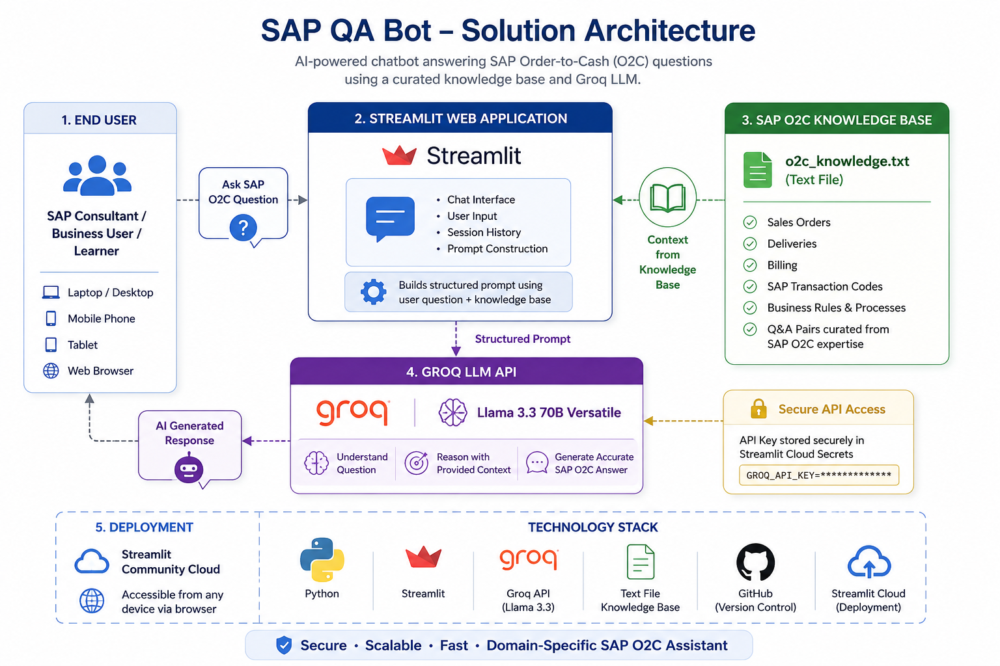
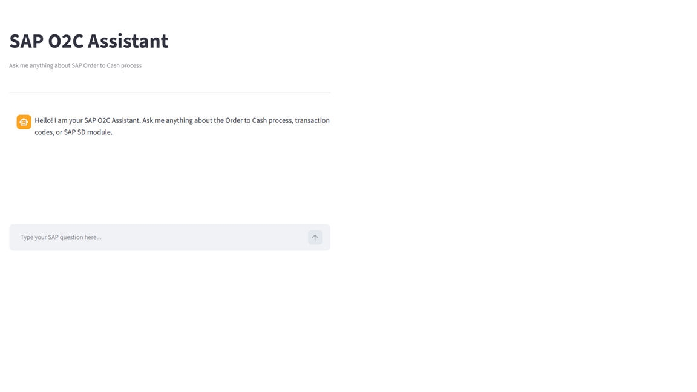
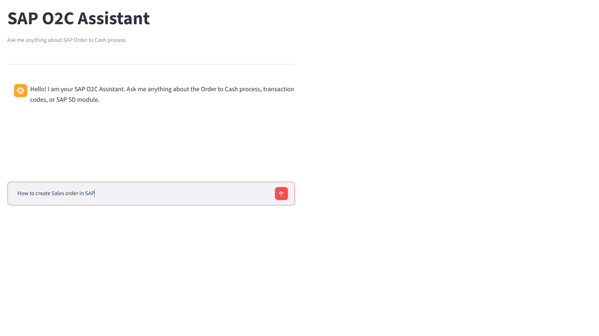
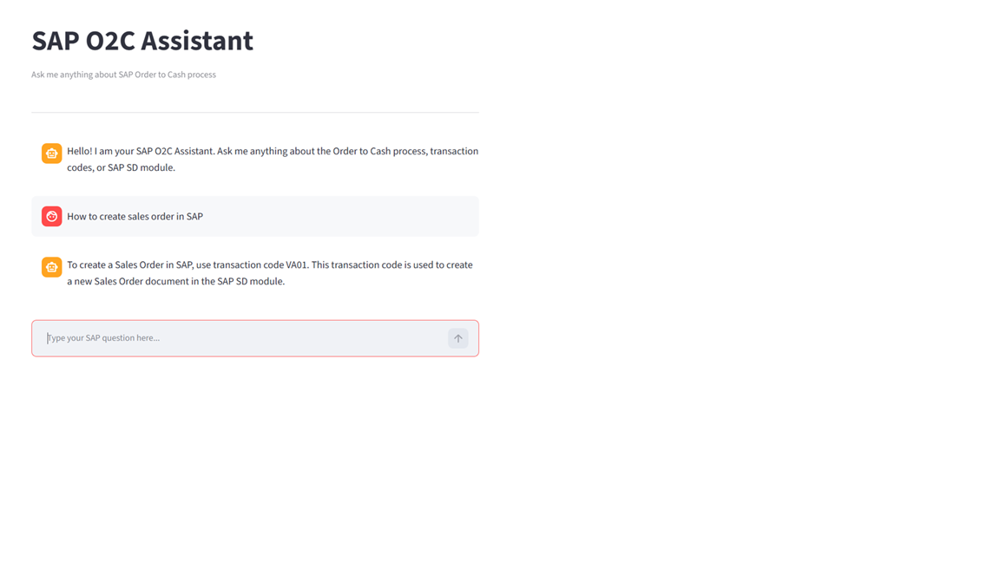

# 🤖 SAP QA Bot

> AI-powered SAP Order-to-Cash (O2C) Question Answering Assistant built with Python, Streamlit and Groq LLM.


---
<p align="center">
  
</p>

## 📌 Project Overview

SAP QA Bot is an AI-powered assistant that answers SAP Order-to-Cash (O2C) business process questions using a curated SAP knowledge base and Groq's Large Language Model.

The application enables SAP consultants, business users, and learners to obtain instant answers without manually searching documentation.

---

## 🎯 Business Problem

Organizations rely heavily on SAP documentation and experienced consultants to answer process-related questions.

Searching documents is time-consuming and often delays business operations.

This project demonstrates how Generative AI can improve productivity by providing immediate, context-aware responses to SAP business process queries.

---

## 🏗️ Solution Architecture

The SAP QA Bot uses a knowledge-driven approach to answer SAP Order-to-Cash (O2C) questions through an AI-powered conversational interface.



---

## ✨ Key Features

- AI-powered SAP O2C assistant
- Natural language question answering
- SAP transaction code guidance
- Context-aware responses
- Streamlit web interface
- Groq LLM integration
- Easy cloud deployment

---

## 📸 Application Screenshots

### Home Screen



---

### Ask a Question



---

### AI Response



---

## ⚙️ Technology Stack

| Layer | Technology |
|--------|------------|
| Programming | Python |
| Frontend | Streamlit |
| AI Model | Groq (Llama 3.3) |
| Knowledge Base | SAP O2C Text Repository |
| Version Control | Git |
| Hosting | Streamlit Community Cloud |

---

## 📁 Repository Structure

```text
sap-qa-bot/
│
├── images/
│   ├── architecture.png
│   ├── Home.png
│   ├── Question.png
│   └── Response.png
│
├── groq_app.py
├── o2c_knowledge.txt
├── requirements.txt
├── README.md
└── .gitignore
```

---

## 🚀 Getting Started

### Clone Repository

```bash
git clone https://github.com/YogeshGhalsasi/sap-qa-bot.git
```

### Install Dependencies

```bash
pip install -r requirements.txt
```

### Configure API Key

Store your Groq API key securely using Streamlit Secrets.

### Run Application

```bash
streamlit run groq_app.py
```

---

## 🎯 Future Enhancements

- Retrieval-Augmented Generation (RAG)
- PDF document support
- Vector Database
- Multi-module SAP support
- Conversation history
- User authentication

---

## 👨‍💻 Author

**Yogesh Ghalsasi**

AI ERP Consultant

LinkedIn:
https://linkedin.com/in/ysghalsasi

GitHub:
https://github.com/YogeshGhalsasi

---

⭐ If you found this project useful, consider giving it a star.
